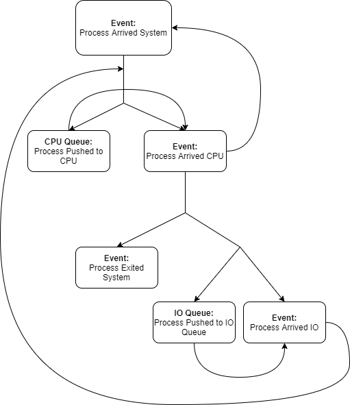

# Lab 1: Discrete Event Simulation
## Author: Luke Dependahl

### Core components
*  The Queues
   *  Event Queue - Priority Queue: to store every change the system makes.
   *  CPU Queue - FIFO Queue: holds processes arriving to the CPU when it's busy.
   *  Network Queue - FIFO Queue: holds processes arriving to the Network when it's busy.
   *  DiskX Queue - FIFO Queue: holds processes arriving to the DiskX when it's busy. (X being 1 or 2)

### Program Workflow by Event
1. Process Arrived System
   1. If CPU is busy or if there are processes waiting for the CPU, push process to the CPU Queue
   2. Else put process on the CPU.
2. Process Arrived CPU
   1. Choose whether the device will quit, do network IO, or disk IO.
      1. If process quits, no longer process events for that process. Eventually it will be popped off of the event queue
      2. If process chooses network then check if the network is busy or if there are processes waiting for the network. If either of those are true, push the process to the event queue. Otherwise put the process on the network device.
      3. If the process chooses to do disk IO. Check if a disk is busy or if a process is waiting for it. If any of those is the case, put the process on the other device. If those cases are true for both devices, put the process on the device with the smallest queue.
      4. Create a new process (new process arrived system).
3. Process Arrived IO Device (Network, Disk1, Disk2)
   1. Exit the device after X time has elapsed.
   2. Request that the process be put back on the CPU (May be placed on the CPU queue or on the CPU).
   3. If there is a process in the devices queue, request that the process be put on the device.

### Individual Component Uses.
*  Simulator.h
   *  Declares Event struct.
      *  Holds all information an event needs.
   *  Contains every functions prototype here.
   *  Creates comparator to be used by Event Queue.
*  Simulate.cpp
   *  Seeds a random number generator with the SEED from config.txt.
   *  Initializes the Event Queue
   *  Pushes intial events (Simulaton finish & first process arrival) to the Event Queue.
   *  Loops through Event Queue and calls an Event Handler for each specific event type.
*  LoadConfig.cpp
   *  Loads a file name "config.txt" in a specified order. (Same order as config.txt in this repository)
*  CreateEvent.cpp
   *  Contains one function that creates an event with given information and returns the event.
*  CreateProcess.cpp
   *  Increments the PID.
*  Random.cpp
   *  Generates a random number between two bounds.
*  EventHandlers.cpp
   *  Handles every event type. (Detailed explination [here](#Program-Workflow-by-Event))
*  Stats.cpp
   *  Gathers all stats using setters placed at every arrival event and every push to device queue call.
