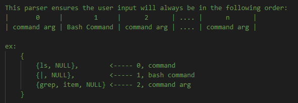

# Lab 2: Shell
## Program Description

### Introduction

This basic implementation of a shell supports the use of simple output redirection, piping and background execution. In addition to supporting the bash commands mentioned, The shell comes with built-in commands described [here](README.md).

### Design

#### Command Extraction
The program revolved centrally around a loop and a parser. There are two main ways to gather commands. The first way is through a batch file and the second way is through user input.

If a batch file is selected the shell reads the file and parses the content line by line. If user input is selected (this is the default method if no batch file is specified) each line the user types is parsed.

#### Parsing
This process is the same regardless of how a command is acquired. Our goal in this step is to break everything into groups, the command group and the bash group. To do this we tokenize the raw user input by spaces. Then we check whether the command entered is a bash command and split the groups accordingly. The final format consist of a vector containing vectors. This format is as follows: 

#### Processing
This is the final and most involved step in the shells execution. The command processor not only processes commands but also handles most of the error handling. The first thing we do in processing is check if the command sequence is valid (ie we received a command, bash, command). Next we check if we do file piping or background execution. If either of those are true we skip everything and process the commands with the appropriate settings. If those are false we allow the program to continue. The following steps are a series of checks to decide what the user wants to do with that command. Eventually processing finishes and we return to the original prompt and wait for another command to be received.

### Testing
Method of testing:
* Brute force forbidden commands.

What I did to test my shells ability to handle errors was fill a batch file with commands I know dont work. You can take a look at this garbage filles batch [here](trash.dahl)