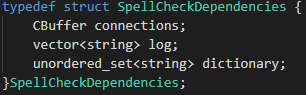

# Lab 3: Multi-Threaded Network Spell Checker
## Program Description

### Introduction

Multi-threaded network spell checking server and multi-threaded client.
The server contains multiple worker threads and a logger threads. The worker threads pull connections from a queue and handle the work, similarly the logger thread monitors a log queue and writes to a log file.

### Design

The program design turned out to be pretty simple. The basic workflow goes as follows:
1. Server starts and begins allowing connections
2. Threads are spawned and continously try to catch connections from the connection queue. When a thread eventually gets a connection it begins servicing the connection.
3. The connection begins to be serviced. The thread waits for a user to enter a word and spell checks it.
4. Finally the word is determeined to be correctly or incorrectly spelled and that result is returned to the user and also sent to a log queue.
5. A thread monitors the log queue and when something arrives in the queue its taken out and written to a file.

### Server
Dependencies: 
Stores essential information needed by all threads running on the server. This essential information is stored in a struct so it can easily be cast to a void pointer and sent as an argument to the threads. 

Functions / Threads: 
1. <b>main - </b> Optionally takes a port and a dictionary as arguments. Sets up initial network connections and continiously loops to accept new connections from potential clients.
2. <b>spawnThreads(SpellCheckDependencies *dependencies) - </b> Takes dependencies struct as an argument. Initializes all mutuxes and condition variables as well as initializes and creates the worker threads and log thread.
3. <b>*worker(void *arg) - </b> Takes dependencies struct as an argument. Pops socket off of the connection queue (circular buffer) and starts the servicing of a client.
4. <b>clientServicer(int socket, SpellCheckDependencies *dependencies) - </b> Accepts a socket and dependencies struct as arguments. Accepts messages (words to spellcheck) from clients, processes them and returns the result to the client as well as pushes the results to allog queue.
5. <b>*logger(void *arg) - </b> Takes depenencies struct as an argument. Writes results stored in log queue to a log file.

Spell Checker: 
1. <b>spellCheck(string word, unordered_set<string> dictionarySet) - </b> Takes a word and a dictionary as arguments. Searches the dictionary for the word specified and returns true or false depending whether it was found or not.
2. <b>convertCase(string word) - </b> Takes a string word as an argument. Makes every character in the word lower case and returns the new lowercase word.
3. <b>loadDictionary(string dictionaryName, unordered_set<string> *dictionarySet) -</b> Takes a dictionary name and a dictionary pointer as arguments. Reads every word from a dictionary into the dictionary set. 

CBuffer: 
1. <b>CBuffer(int size) - </b> Initializes a circular buffer with max size of size.
2. <b>slide(int value) -</b> Takes an integer as an argument. Places the value in the circular buffer.
3. <b>snatch() -</b> Returns the most recent value of the circular buffer and decrements its size.
4. <b>peep(int index) -</b> Takes an integer as an argument. Returns the value at the specified index.
5. <b>size() -</b> Returns the size of the circular buffer.

### Client
1. <b>spawnThreads(int numThreads, Args *args) -</b> Same as above.
2. <b>*makeConnection(void *args) -</b> Accepts a struct containing port, ip and a log vector. Establishes a connection to the server at the host 
3. <b>randomWordGenerator(unordered_set<string> dictionary) -</b> Takes in a dictionary and returns a random word from it. (The dictionary provided to this function contains a mix of currectly and incorrectly spelled words for testing.)
4. <b>loadDictionary(unordered_set<string> *dictionarySet) -</b> Same as above.
5. <b>convertCase(string word) -</b> Same as above.
6. <b>*logger(void *args) -</b> Same above. (This time it logs PID, time and the word sent to the server.)

### Testing
In order to make sure my spell checker actually worked I created an additional dictionary of 60 words where some words are correctly spelled and others are purposely mispelled. I used this dictionary when testing my server with the python client as well as the client I made as extra credit. My client connects to the server with multiple different threads then tests a single word from th dictionary at random. In addition to these testing methods I manually tested connecting, disconnecting abuptly, and sending words with multiple netcat and telnet connections at once.